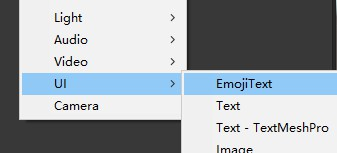

# EmojiText (Emoji, Hyperlink for UGUI)

Emoji and Hyperlink for Unity UGUI Text ,继承 UGUI 中的 Text 组件，实现超链接和图文混排，[Github 地址](https://github.com/HedgehogSir/EmojiText.git)

参考了 [GText](https://github.com/garsonlab/GText)

相较于 GText 修改了：
- 新增点击超链接范围外的回调
- 优化下划线表现
- 新增了超链接颜色渐变
- 删除了单独的下划线
- 删除了自定义加载动画

效果图：


输入内容：

```
测试[E1]默认大小且无点击表情
测试[E2|40#E2Cclick]自定义大小且可点击表情
测试[A1|40#AnimationClick]自定义大小且可点击动态表情
测试[0x01#ff0000#ff00ff#ClickLink=HyperLink超链接]可点击且渐变
测试[0x02|40|20#ff00ff#ClickImg=E3]ceshi自定义长宽的Image
```

# 使用说明

## 准备图集

将需要做成 Emoji 的图片打包成图集。

把准备好的图片放到 Icon 文件夹中，Emoji 表情图片的分辨率，必须是 2 的次方，比如 64x64，可以使用 EasyImageModifier 批量修改文件大小，不然边角可能有瑕疵。

Icon 内的所有图集要设置可被读写。

## 打包图集和材质

选中 Icon 文件夹，右键 EmojiText Build 即可（Icon 内的所有图集要设置可被读写）


Build 完成以后，Atlas 多出了三个文件


接下来就可以在 Hierarchy 面板中创建 EmojiText 查看效果了



在实际项目中，EmojiText 可在 Awake 中定义 材质球 和 配表的加载